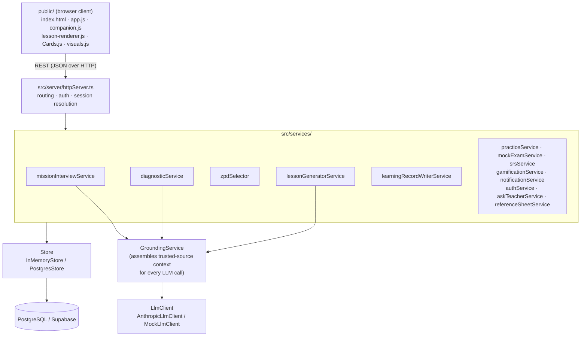
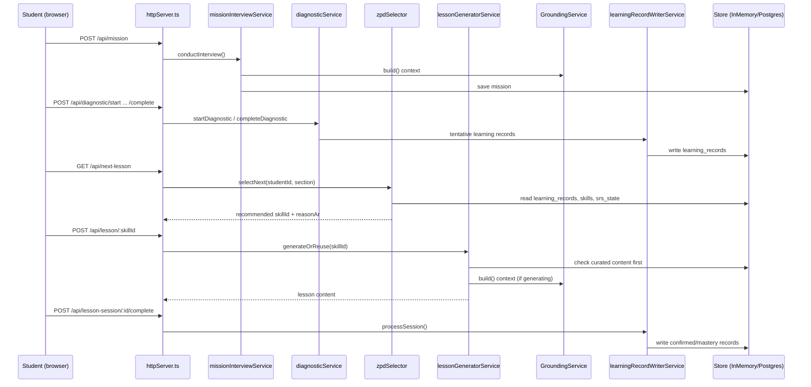

# System Architecture Diagram

```mermaid
flowchart TD
    Browser["public/ (browser client)\nindex.html · app.js · companion.js\nlesson-renderer.js · Cards.js · visuals.js"]
    Server["src/server/httpServer.ts\nrouting · auth · session resolution"]

    subgraph Services["src/services/"]
        Mission["missionInterviewService"]
        Diagnostic["diagnosticService"]
        Zpd["zpdSelector"]
        LessonGen["lessonGeneratorService"]
        Writer["learningRecordWriterService"]
        Other["practiceService · mockExamService · srsService\ngamificationService · notificationService\nauthService · askTeacherService · referenceSheetService"]
    end

    Grounding["GroundingService\n(assembles trusted-source context\nfor every LLM call)"]
    Llm["LlmClient\nAnthropicLlmClient / MockLlmClient"]
    Store["Store\nInMemoryStore / PostgresStore"]
    Db[("PostgreSQL / Supabase")]

    Browser -- "REST (JSON over HTTP)" --> Server
    Server --> Services
    Mission --> Grounding
    Diagnostic --> Grounding
    LessonGen --> Grounding
    Grounding --> Llm
    Services --> Store
    Store --> Db
```

## Request lifecycle (onboarding → first lesson)

```mermaid
sequenceDiagram
    participant S as Student (browser)
    participant API as httpServer.ts
    participant Mission as missionInterviewService
    participant Diag as diagnosticService
    participant Zpd as zpdSelector
    participant Lesson as lessonGeneratorService
    participant Ground as GroundingService
    participant Writer as learningRecordWriterService
    participant DB as Store (InMemory/Postgres)

    S->>API: POST /api/mission
    API->>Mission: conductInterview()
    Mission->>Ground: build() context
    Mission->>DB: save mission
    S->>API: POST /api/diagnostic/start ... /complete
    API->>Diag: startDiagnostic / completeDiagnostic
    Diag->>Writer: tentative learning records
    Writer->>DB: write learning_records
    S->>API: GET /api/next-lesson
    API->>Zpd: selectNext(studentId, section)
    Zpd->>DB: read learning_records, skills, srs_state
    Zpd-->>API: recommended skillId + reasonAr
    S->>API: POST /api/lesson/:skillId
    API->>Lesson: generateOrReuse(skillId)
    Lesson->>DB: check curated content first
    Lesson->>Ground: build() context (if generating)
    Lesson-->>API: lesson content
    S->>API: POST /api/lesson-session/:id/complete
    API->>Writer: processSession()
    Writer->>DB: write confirmed/mastery records
```

See [`docs/architecture/`](../architecture/) for the written deep-dive behind
every box in these diagrams.
